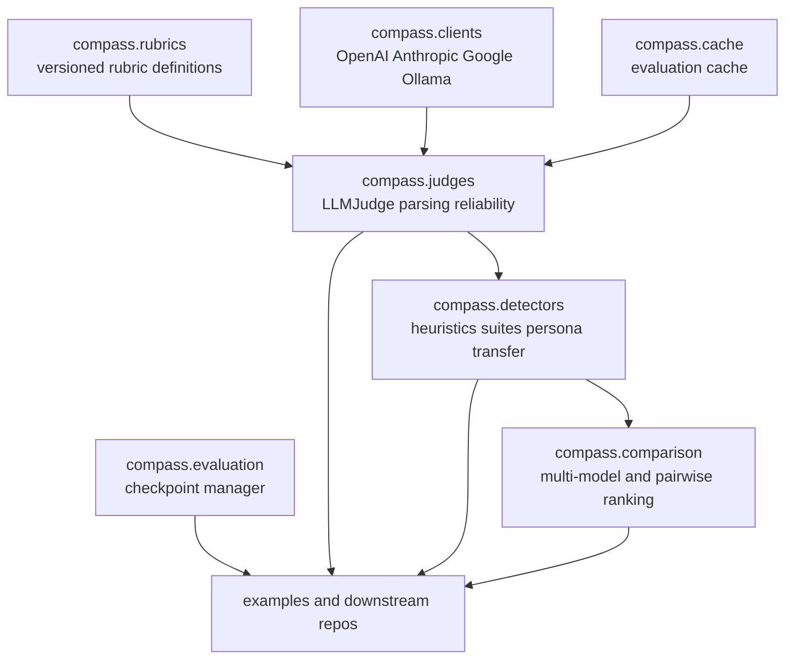
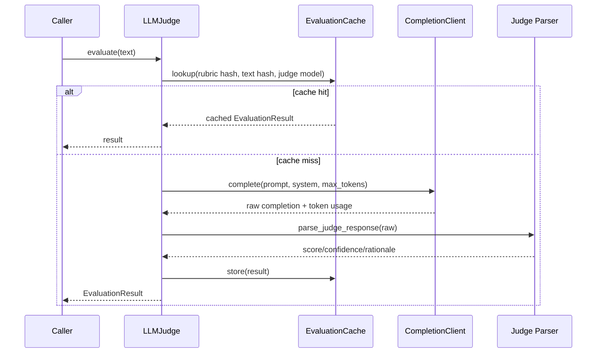
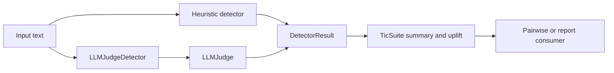

# Compass Architecture

Compass is the shared evaluation library. It owns rubric definitions, judge and
detector primitives, client wrappers, caching, checkpointing, and comparison
utilities.

## Module Layout

## Judge Flow

## Detector and Suite Flow

## Boundaries

- `compass` should stay reusable across projects.
- Downstream repos should import Compass primitives instead of forking them.
- Shared suites and rubrics belong here; project-specific orchestration belongs
  outside this repo.
