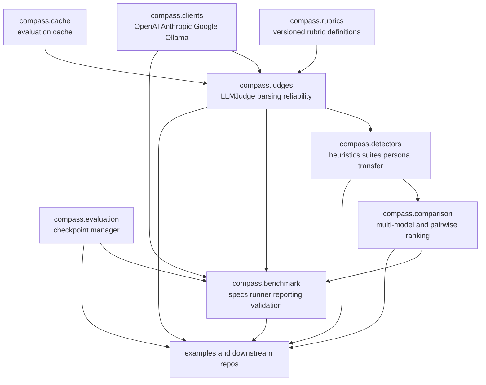
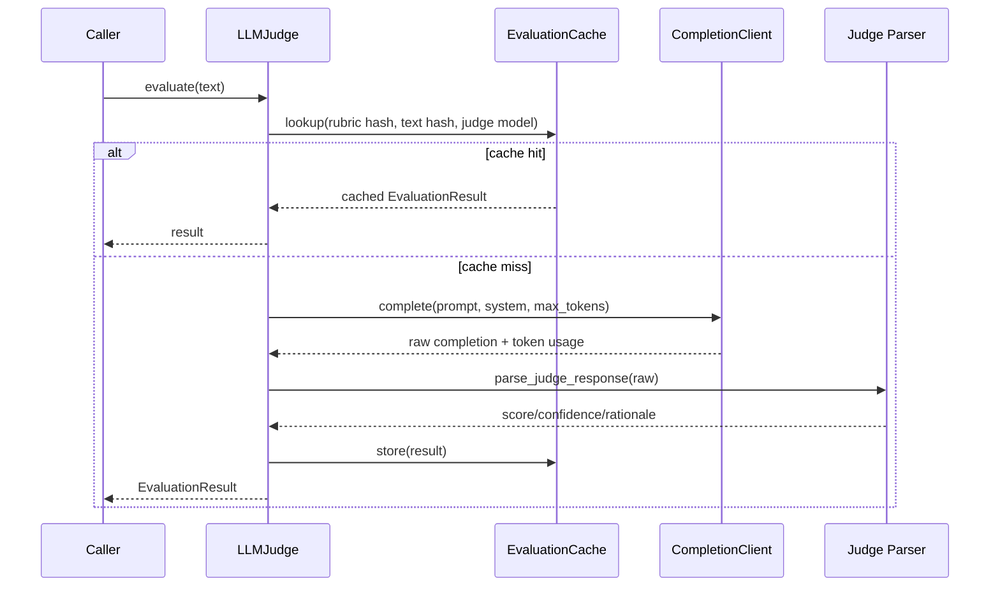
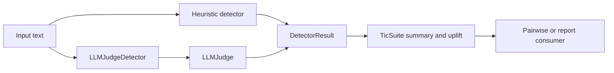
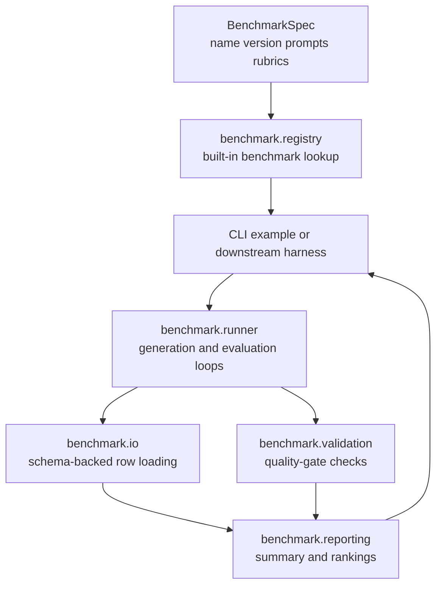

# Compass Architecture

Compass is the shared evaluation library. It owns rubric definitions, judge and
detector primitives, client wrappers, caching, checkpointing, comparison
utilities, and benchmark runner infrastructure.

## Module Layout

## Judge Flow

## Detector and Suite Flow

## Benchmark Flow

## Benchmark Boundaries

- Benchmark families should be introduced through `BenchmarkSpec` and registry
  entries, not through new branches inside the runner.
- Examples should stay thin wrappers over `compass.benchmark`.
- Report validation is part of the benchmark contract, not an optional extra.
- Quality diagnostics are first-class output fields. They are used to separate
  generation failures from rubric violations.

## Boundaries

- `compass` should stay reusable across projects.
- Downstream repos should import Compass primitives instead of forking them.
- Shared suites, rubrics, and benchmark core primitives belong here.
- Project-specific orchestration belongs outside this repo.
- Provider-specific request quirks belong inside client adapters; the shared
  adapter contract is documented in `docs/CLIENT_ADAPTERS.md`.
